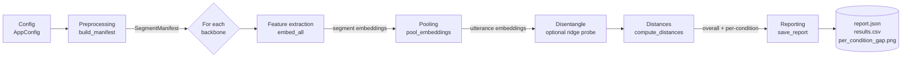
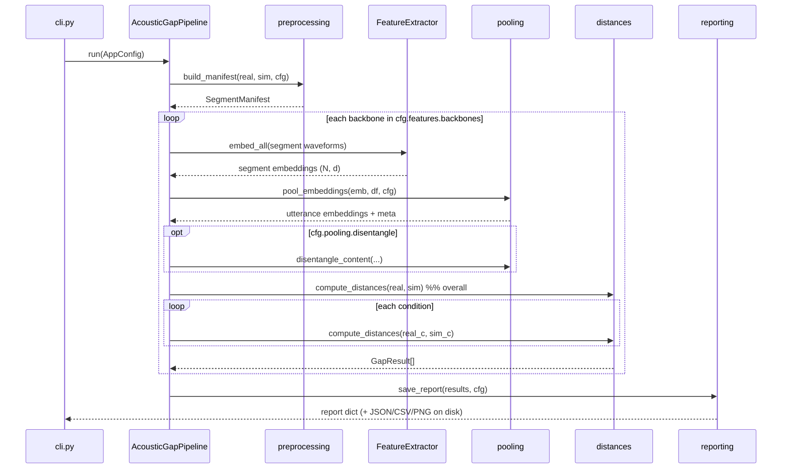
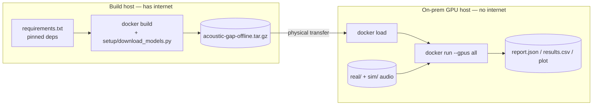

# Architecture & Framework

This document describes **how `acoustic-gap` is built** — the algorithmic pipeline,
the software framework that makes each stage swappable, the data contracts between
modules, and the extension points. For the *math* behind the metrics see
[THEORY.md](THEORY.md); for *setup/usage* see the [README](../README.md).

---

## 1. Design principles

| Principle | How it shows up |
|-----------|-----------------|
| **Config-driven, not hard-coded** | One `AppConfig` (dataclasses) selects backbones, pooling, metrics, and reporting. No behavior is baked into code paths. |
| **Swappable components behind interfaces** | Backbones implement one abstract class (`FeatureExtractor`); pooling, distances, and reporting are pure functions keyed off a shared data contract. |
| **A single source of truth** | Every stage reads/writes the **segment manifest** (a DataFrame + audio dict). Nothing passes bespoke tuples between modules. |
| **Fully offline** | All model loads use local paths + `HF_HUB_OFFLINE=1`. A dependency-free `dummy` backbone lets the whole framework run (and be tested) without weights. |
| **Diagnosis over a single score** | The pipeline computes every metric *per condition*, so the output localizes the gap instead of collapsing it to one number. |

---

## 2. The pipeline at a glance



**Data flow in one sentence:** *config → segment manifest (with per-segment
condition labels) → per-backbone segment embeddings → utterance pooling (+ optional
content disentanglement) → FAD/MMD/Wasserstein computed overall and per condition →
structured report with a flagged largest contributor.*

---

## 3. Module responsibilities

```
acoustic_gap/
├── config.py          # AppConfig + sub-configs; YAML/JSON load + validate
├── logging_utils.py   # one-line logging setup (logging, never print)
├── preprocessing.py   # audio I/O, resample, mono, segment, silence filter → manifest
├── features/
│   ├── base.py        # FeatureExtractor (ABC) — the backbone contract
│   ├── panns.py       # PANN / VGGish via fadtk / frechet_audio_distance
│   ├── wavlm.py       # WavLM x-vector via transformers (local, offline)
│   ├── dummy.py       # dependency-free descriptor backbone (tests / dry-runs)
│   └── __init__.py    # build_extractors(cfg) factory
├── pooling.py         # mean / RNN pooling + ridge-probe disentanglement
├── distances.py       # frechet_distance, mmd_rbf, *_wasserstein, compute_distances
├── reporting.py       # GapResult, build_report, save_report, plotting
├── pipeline.py        # AcousticGapPipeline — the orchestrator
└── cli.py             # argparse entry point (run / init-config)
```

Each module has a **single responsibility** and depends only on `config` + the
shared data contracts (§5). This is what makes any one stage replaceable without
touching the others.

---

## 4. The framework: interfaces & extension points

### 4.1 Backbones — the `FeatureExtractor` contract

All embedding models implement one small abstract class (`features/base.py`):

```python
class FeatureExtractor(abc.ABC):
    name: str
    sample_rate: int
    @property
    def embedding_dim(self) -> int: ...
    def embed_batch(self, waveforms: Sequence[np.ndarray]) -> np.ndarray: ...
    # embed_all() is provided by the base class (mini-batching over embed_batch)
```

The pipeline never imports a concrete backbone; it calls `build_extractors(cfg)`
(`features/__init__.py`), which instantiates whatever `cfg.features.backbones`
lists. Heavy backbones import their deps **lazily** (on first `embed_batch`), so a
`dummy`-only run never pulls in torch/fadtk.

> **Add a backbone** in three steps: (1) subclass `FeatureExtractor` and implement
> `embed_batch` + `embedding_dim`; (2) register a branch in `build_extractors`;
> (3) add its name to the config's `valid_backbones`. Nothing else changes.

### 4.2 Pooling strategies

`pool_embeddings(embeddings, df, cfg)` dispatches on `cfg.pooling.strategy`
(`"mean"` or `"rnn"`) and returns `(utterance_embeddings, utterance_df)`.
Disentanglement is a separate, toggleable function (`disentangle_content`) applied
after pooling. **Add a strategy** by adding a branch here — the pipeline just calls
`pool_embeddings`.

### 4.3 Distances

`compute_distances(real_emb, sim_emb, cfg)` returns a `{metric_name: value}` dict.
Each metric is an independent pure function (`frechet_distance`, `mmd_rbf`,
`per_dimension_wasserstein`, `sliced_wasserstein`, `wasserstein_pot`). **Add a
metric** by writing a function and adding it to `compute_distances` + the config's
`valid_metrics`; the reporter picks it up generically.

### 4.4 Reporting

`save_report(results, cfg)` consumes a flat `List[GapResult]` and is agnostic to
which backbones/metrics/conditions produced them — so new backbones and metrics
appear in the JSON/CSV/plot automatically.

---

## 5. Data contracts (the glue)

The modules communicate through three well-defined structures. Keeping these stable
is what allows independent evolution of each stage.

### 5.1 `SegmentManifest` (`preprocessing.py`)

A `pandas.DataFrame` of one row per **segment**, plus an `audio: Dict[int, np.ndarray]`
mapping `segment_id → waveform`. The DataFrame stays light (audio held separately),
sliceable, and CSV-serialisable.

| column | meaning |
|--------|---------|
| `segment_id` | stable int key into the `audio` dict |
| `dataset` | `"real"` or `"sim"` |
| `source_path` | originating file (groups segments into utterances) |
| `segment_index` | window index within the source clip |
| `start_sample` / `end_sample` | window bounds in samples |
| `sample_rate` | common rate (default 16 kHz) |
| `rms_dbfs` | segment loudness (for silence filtering) |
| `condition` | acoustic condition label (e.g. `clean`, `reverb-only`, `noise-only`, `mic-*`) |

The **`condition` column is the backbone of the diagnosis**: it is inferred from
the immediate sub-directory under each dataset root, and every downstream slice is
keyed off it.

### 5.2 `GapResult` (`reporting.py`)

One measured distance per `(backbone, condition, metric)` cell:

```python
@dataclass
class GapResult:
    backbone: str      # "panns" | "wavlm" | ...
    condition: str     # "__overall__" or a condition label
    metric: str        # "fad" | "mmd" | "wasserstein_1d" | "wasserstein_mv" | ...
    value: float       # lower = smaller gap
    n_real: int
    n_sim: int
```

### 5.3 Report JSON (`build_report`)

```jsonc
{
  "interpretation": "All distances are LOWER-IS-BETTER ...",
  "headline": {
    "backbone": "wavlm",
    "metric": "wasserstein",
    "largest_contributor": { "condition": "noise-only", "backbone": "wavlm",
                             "metric": "wasserstein", "value": 0.81 }
  },
  "top_level_scores":        { "<backbone>": { "<metric>": <float> } },
  "per_condition_breakdown": { "<backbone>": { "<condition>": { "<metric>": <float> } } }
}
```

---

## 6. Control flow of a run



Per-condition cells with data on only one side (real *or* sim but not both) are
skipped with a log line — only matched conditions yield a comparable distance.

---

## 7. Cross-cutting concerns

- **Configuration & validation.** `AppConfig.from_dict` builds nested sub-configs;
  `AppConfig.validate()` rejects inconsistent settings (bad sample rate, hop >
  window, unknown backbone/metric, bad OT backend) *before* any expensive work.
- **Logging, not printing.** Every module logs through the stdlib `logging`
  framework (`logging_utils.configure_logging`); only the CLI prints the final
  human summary.
- **Determinism.** A single `random_seed` flows into subsampling, the RNN
  summarizer, and the sliced-Wasserstein projections, so runs are reproducible.
- **Bounded memory (streaming).** `run()` builds a *metadata-only* manifest
  (`keep_audio=False`) and processes one file at a time via `iter_utterances` —
  load → embed with every backbone → pool to a single utterance vector → discard
  the audio. Peak memory is one file's segments plus the compact utterance
  embeddings, independent of corpus length. (Granularity is per file; split a
  single multi-hour recording before running.)
- **Tractability guards.** O(n²)/O(n³) estimators (MMD, exact EMD) subsample to
  `max_samples`; sliced-Wasserstein is the linear-time default for large sets.
- **Offline enforcement.** WavLM loads with `local_files_only=True` and
  `HF_HUB_OFFLINE=1`/`TRANSFORMERS_OFFLINE=1`; the Docker image bakes weights into
  `/opt/model_cache` at build time. See the [README](../README.md) Docker section.

---

## 8. Deployment topology (air-gapped)



The build host bakes both pip dependencies **and** model weights into one image;
the air-gapped host only needs the NVIDIA driver + Container Toolkit and the loaded
image. Nothing reaches the network at runtime.

---

## 9. Testing framework

`tests/` mirrors the module layout and runs entirely offline against tiny synthetic
WAVs (`conftest.py` fixtures) using the `dummy` backbone:

| test module | validates |
|-------------|-----------|
| `test_config.py` | config round-trip + validation guards |
| `test_preprocessing.py` | segmentation, overlap, short/silent handling, manifest |
| `test_features.py` | the `FeatureExtractor` contract (shape, determinism, batching) |
| `test_pooling.py` | mean pooling math + content disentanglement removal |
| `test_distances.py` | metric sanity: ~0 for identical, larger under a shift |
| `test_pipeline_and_reporting.py` | end-to-end run + correct largest-contributor flag |

This exercises the **framework wiring and metric math** without any weights; the
heavy backbones are only exercised in a real `run` with vendored checkpoints.
